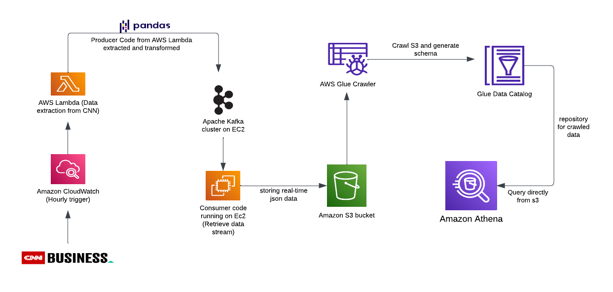
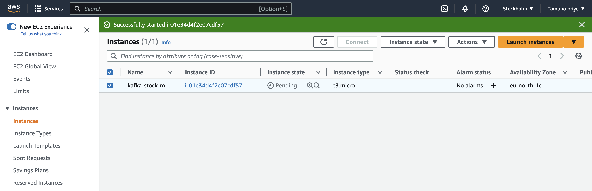
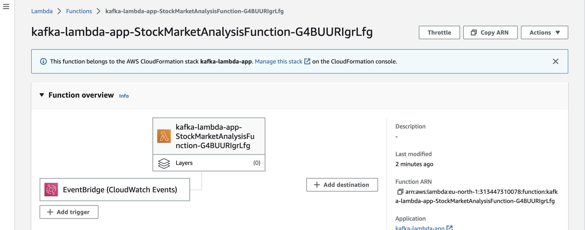
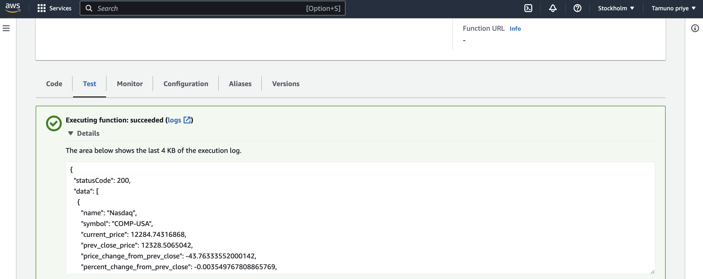
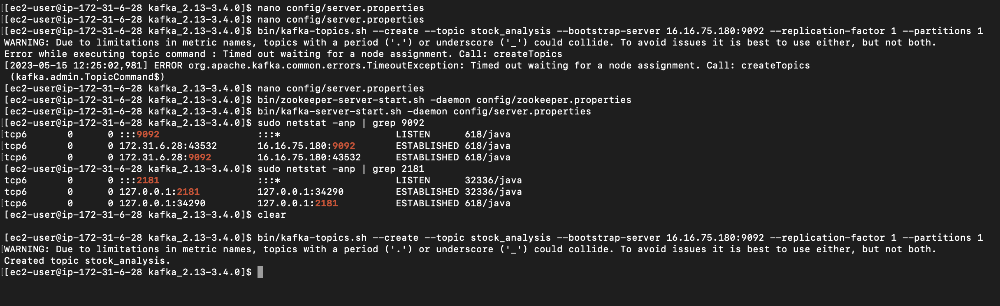
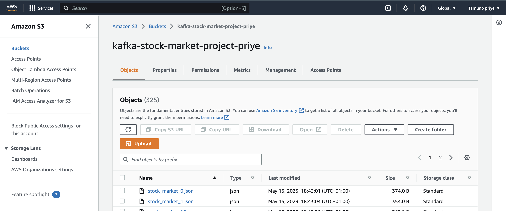
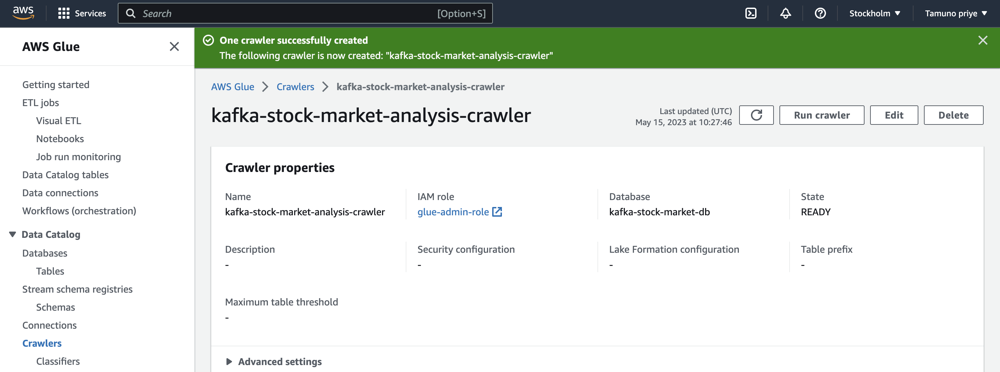
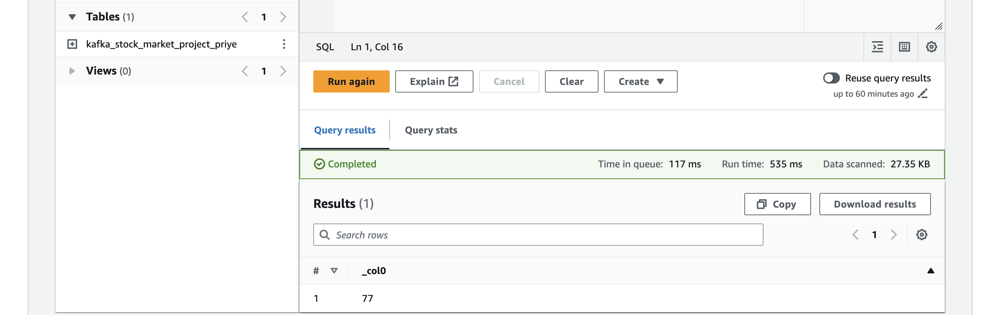
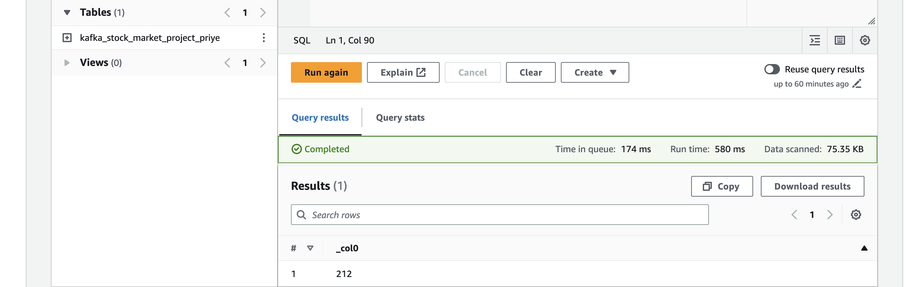

# Stock Market Real-Time Data Analysis Using Kafka
This is an End-To-End Data Engineering Project on Real-Time Stock Market Data, using AWS and Kafka.  

### Technologies used
- <b>Apache Kafka</b>: This is an event streaming platform used to collect, process, store, and integrate data at scale. Its Python API was utilized to stream data received from the web API  
- <b>AWS EC2</b> : This is a cloud-based computing service that allows users to quickly launch virtual servers and manage cookies, security, and networking from an easy-to-use dashboard. It was used to host Kafka server for this project.   
- <b>AWS Lambda</b>: This is a serverless compute service that lets you run codes without  provisioning or managing any server. lambda functions can be used to run code in response to events like changes in S3, DynamoDB, cron jobs, etc. For this project, it was used to run the data scrape function triggered every hour.   
- <b>AWS Cloudwatch</b>: This is a monitoring and management service that provides data and actionable insights for AWS, hybrid, and on-premises applications and resources. For this project it was used to collect and aggregate metrics and logs from the Lambda functions. The performance events are ingested as CloudWatch logs to simplify monitoring and troubleshooting.   
- <b>AWS Severless Application Model (SAM)</b>: This is a service that is designed to make the creation, deployment, and execution of serverless applications as simple as possible. This can be done using AWS SAM templates. For this project it was used to deploy our lambda function.   
- <b>AWS S3</b>: This is a highly scalable object storage service that stores data as objects within buckets. It is commonly used to store and distribute large media files, data backups and static website files. For this project it is used to store data streamed from kafka.   
- <b>AWS Glue</b> :Glue Crawler is a fully managed service that automatically crawls your data sources, identifies data and infer schemas to create an AWS Glue Data Catalog. This Catalog is a fully managed metadata repository that makes it easy to discover and manage data that has been crawled.It allows us to query the data directly from S3 without loading it first.   
- <b>AWS Athena</b>: Athena is an interactive query service that makes it easy to analyze data in Amazon S3 using SQL commands. For this project it is used to analyze data in Glue Data Catalog or in other S3 buckets.   

## Architecture

### Languages used
- Python
- yaml(for AWS SAM templates)  

### Datasets
Data was scraped from - https://edition.cnn.com/markets using Python requests module.
The website does not provide a public API, hence it was reverse engineered to get endpoints. Postman was then used to analyze endpoint

#### Development Process
1. Created EC2 Instance (AWS Linux AMI 2) to run python consumer file and host kafka  
 

2. Installed AWS SAM and created Lambda function using SAM Template. Sample template used can be found <a href="https://github.com/priye-1/Real_time_End_to_End_Pipeline_using_Kafka/blob/master/kafka-lambda-app/sample_template.yaml">here</a> 
  
Tested lambda Function before enabling cron
  
    

2. Installed Kafka and Java on ec2 Instance, and ran kafka and zookeper in background to test producer and consumer clients 
 

3. Created S3 Bucket and IAM role to enable access to s3 from any instance  
 

4. Created and ran crawler on AWS Glue. This includes creating a database, chosing a data source, amd creating an IAM role that allows Glue to access S3 
 

5. Access Athena to preview data, with time the number of rows increases due to the cron job that runs hourly on aws lamdba. 

 
 

#### Pipeline Flow
start consumer file -> scrape data using aws lambda created through sam -> transform data -> move to producer client -> consumer reads data and uploads to s3 -> Data schema is crawled through Glue -> Athena queries data directly from s3   

#### Necessary Files
1. Kafka commands can be found <a href="https://github.com/priye-1/Real_time_End_to_End_Pipeline_using_Kafka/blob/master/commands.txt">here</a>
2. Generated app through SAM can be found <a href="https://github.com/priye-1/Real_time_End_to_End_Pipeline_using_Kafka/tree/master/kafka-lambda-app">here</a> This module contains the kafka producer and transformation code.
3. Kafka Consumer file can be found <a href="https://github.com/priye-1/Real_time_End_to_End_Pipeline_using_Kafka/blob/master/kafka_consumer.py">here</a>

#### AWS SAM
A sample template.yaml is also provided to show how SAM is used to configure lambda functions.

### References

<li><a href='https://docs.aws.amazon.com/athena/latest/ug/getting-started.html'>Creating database for AWS Athena</a></li>
<li><a href='https://docs.aws.amazon.com/IAM/latest/APIReference/API_CreateAccessKey.html'>creating access key for s3 usage'</a></li>
<li><a href='https://docs.aws.amazon.com/cli/latest/userguide/cli-chap-welcome.html'>Install and configure AWS CLI</a></li>
<li><a href='https://docs.aws.amazon.com/serverless-application-model/latest/developerguide/what-is-sam.html'>What is AWS SAM? </a></li>
<li> <a href='https://docs.aws.amazon.com/serverless-application-model/latest/developerguide/serverless-getting-started-hello-world.html'> Using AWS SAM </a></li>
<li><a href='https://s3fs.readthedocs.io/en/latest/'>Using S3fs</a></li>
<li><a href='https://docs.aws.amazon.com/elasticbeanstalk/latest/dg/eb-cli3-install-linux.html'> Installing Python on ec2</a></li>
<li><a href='https://docs.aws.amazon.com/serverless-application-model/latest/developerguide/sam-property-function-schedule.html'>Understanding Schedule Property in SAM</a> </li>
<li><a href='https://docs.aws.amazon.com/lambda/latest/dg/services-cloudwatchevents-expressions.html'>setting cron jobs in SAM</a></li>
<li><a href='https://docs.aws.amazon.com/serverless-application-model/latest/developerguide/sam-resource-function.html#sam-function-architectures'> Configuring other SAM properties like memory size, timeout or env variables</a></li>
